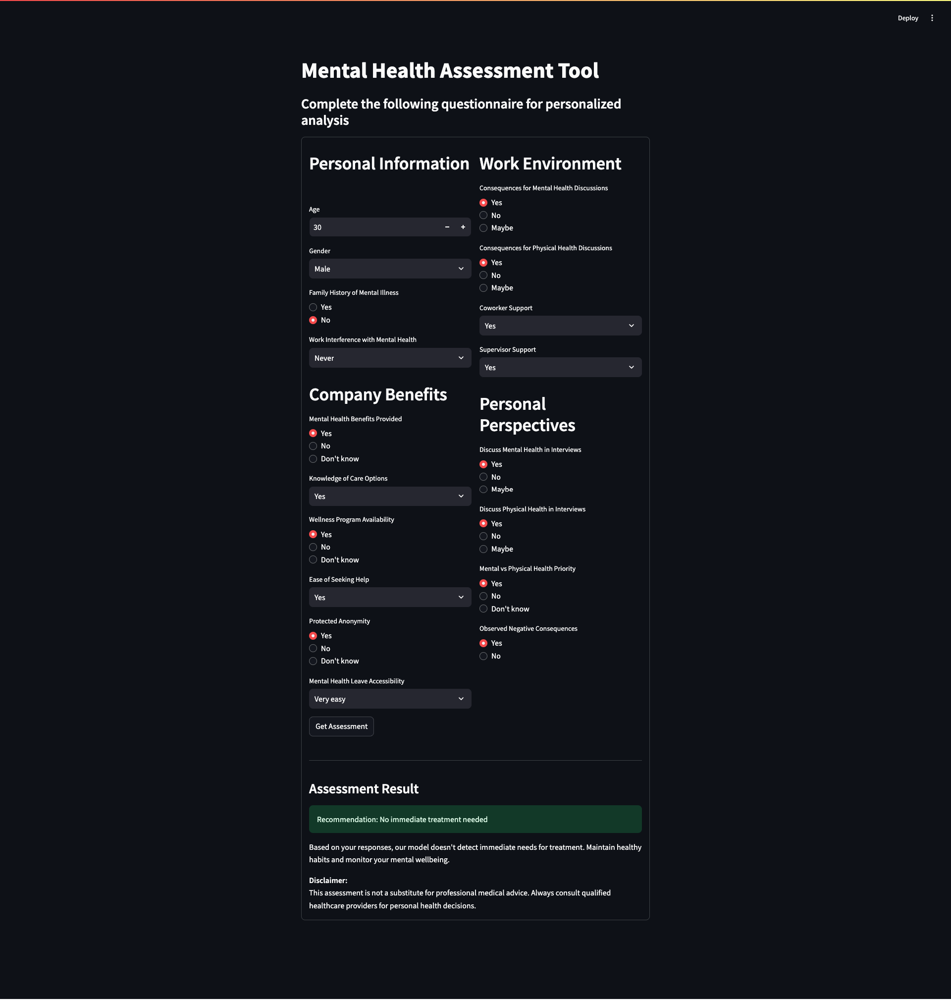
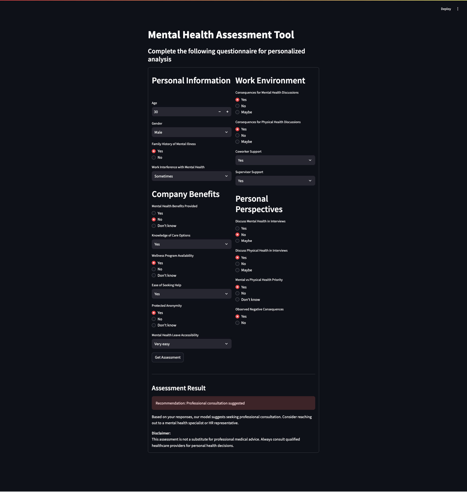

# Self-Analysis Mental Health Model

This project provides a self-analysis mental health assessment tool using machine learning models to predict whether an individual should seek mental health treatment based on survey responses.

## Dataset Preprocessing Steps

1. **Load the dataset:** The dataset (`survey.csv`) is loaded using Pandas.
2. **Handle missing values:**
   - Replace "NA" strings with actual NaN values.
   - Drop the `comments` column (too many missing values).
   - Fill missing categorical values with the mode of the respective column.
3. **Encode categorical features:**
   - Apply `LabelEncoder` to categorical columns such as `Gender`, `family_history`, `work_interfere`, etc.
4. **Define features and target variable:**
   - Features include age, gender, work interference, benefits, care options, etc.
   - The target variable (`treatment`) is encoded as 1 (seek treatment) or 0 (no treatment needed).
5. **Split dataset:**
   - The data is split into training (80%) and testing (20%) sets.

## Model Selection Rationale

Two models were trained and evaluated:

1. **Random Forest Classifier:**
   - Chosen for its robustness and ability to handle categorical features.
   - Provides feature importance for interpretability.
2. **XGBoost Classifier:**
   - Selected for better performance and handling of imbalanced datasets.
   - Provides SHAP values for explainability.

Based on evaluation metrics (accuracy, classification report, and confusion matrix), RandomForst was chosen for deployment due to its higher predictive performance.

## How to Run the Inference Script

### **Running via CLI**

```bash
python model_testing.py
```

Follow the interactive prompts to input your data and get a prediction.

### **Running via Streamlit UI**

```bash
streamlit run mental_health_app.py
```

This will launch a web interface where users can fill out a form and receive predictions.

## UI/CLI Usage Instructions

### **Command Line Interface (CLI)**

The script `model_testing.py` prompts users to enter their demographic and workplace-related details interactively. Based on the responses, the model predicts whether the user should seek mental health treatment.

### **Streamlit Web UI**

The `mental_health_app.py` script provides an easy-to-use web-based UI:

1. **Fill out the questionnaire:** Enter details about age, gender, work interference, and mental health benefits.
2. **Submit the form:** Click the "Get Assessment" button.
3. **Receive prediction:** The app displays whether treatment is recommended or not.

## Installation and Dependencies

1. Clone the repository:
   ```bash
   git clone https://github.com/Rishabhspace/Arogo-AI
   cd Arogo-AI
   ```
2. Install required dependencies:
   ```bash
   pip install -r requirements.txt
   ```

## Screenshot of Streamlit App





## Disclaimer

This assessment tool is not a substitute for professional medical advice. If you have concerns about your mental health, please seek help from a qualified professional.
